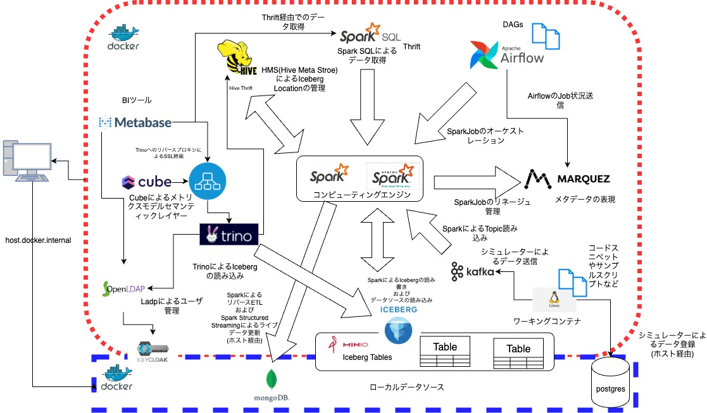
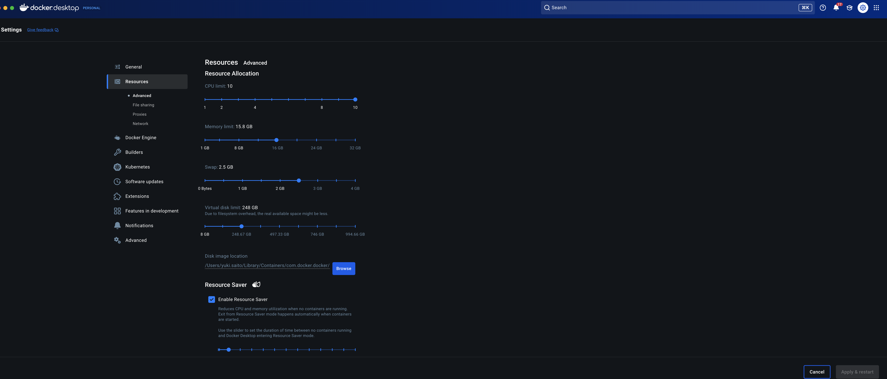

<p align="center"><b>以下の書籍に関するリポジトリです。</b></p>

<p align="center">
    <a href="https://www.amazon.co.jp/dp/4297145634/ref=sspa_dk_detail_0?psc=1&pd_rd_i=4297145634&pd_rd_w=BXEhW&content-id=amzn1.sym.f293be60-50b7-49bc-95e8-931faf86ed1e&pf_rd_p=f293be60-50b7-49bc-95e8-931faf86ed1e&pf_rd_r=VZ7P7XN3YX1NAMJAPZEB&pd_rd_wg=CuOVv&pd_rd_r=31953068-34be-40e1-978d-b417f6b20227&s=books&sp_csd=d2lkZ2V0TmFtZT1zcF9kZXRhaWw">
        
    </a>
    <a href>
        
    </a>
</p>

<div align="center">
    


[](https://github.com/yk-st/data-platform-on-local/releases)


</div>

# リポジトリについて

本リポジトリは『エンジニアのための データ分析基盤入門（実践編）』の検証用リポジトリです。  
本書の内容を再現できること（再現性）を優先しているため、利用するプロダクトやバージョンは常に最新とは限りません。

読者の皆さまにも実際に手を動かして再現していただけることを意図し、Dockerを前提に手順と構成を用意しています。

筆者の検証環境では動作確認を行っていますが、OS・CPU（Intel/Apple Silicon）・Docker/仮想化設定・リソース制限・ネットワーク設定などの環境差分により、同一結果を再現できない場合があります。  
そのため、各環境固有の差分吸収（設定調整、バージョン更新、リソース確保等）は、各自で適宜対応してください。

筆者は、利用プロダクトのバージョンアップ等による変更やメンテナンス状況の変化があった場合に、必要に応じてベストエフォートで本リポジトリを更新します。  

なお、同梱する第三者ソフトウェアには、それぞれのライセンスが適用されます。

# 全体像



# セットアップ手順

インストールにあたっては、Windows/Macなどご自身の環境に合ったインストーラーを選択してください。

```
git clone https://github.com/yk-st/data-platform-on-local.git -b v1.0.0
```

※ -bはv1.x.xの最新のタグを指定してください。

クローン後は各ディレクトリでdocker compose upコマンドを実行してください。

# コンテナ利用時の注意点
host.docker.internalを使って通信している部分があるためLinux系OS利用の方はextra_hostsの設定が必要になる場合があります。

## Docker Desktopのインストール

Docker Desktopをインストールしてください
https://docs.docker.com/desktop/

### Docker Hubのアカウントの準備

なくても利用可能ですが、イメージのPull数などに制限があるため、アカウントを作成しておくことをお勧めします。
https://hub.docker.com/

### リソースの設定

Docker DesktopのDashbord画面右上の歯車マークより、リソース設定を行い再起動を実行してください。

参考までに筆者の設定です。

画像より少なくとも動作可能ですが、リソースはできる限り多めに設定しておくことをお勧めします。

## VScodeのインストール

公式のダウンロードサイトからダウンロードしてインストールしてください。
Cursorでも問題ありません。

Vscode  https://azure.microsoft.com/ja-jp/products/visual-studio-code

# コンテナの起動

## Docker Networkの作成

今回の環境で利用するネットワークを作成します。
VSCodeのターミナルで以下のコマンドを実行し、作成してください。

```
docker network create backend
```

各ディレクトリのフォルダに移動し、docker compose up -dコマンドを実行します。

e.g minioコンテナを動かしたい場合

```
cd ./data-platform-on-local/minio
docker compose up -d
```

コンテナの起動状況は、docker desktopのDashbordで確認が可能です。

## 証明書の作成

証明書は配布していないため、以下の手順に従って各自の環境で作成してください。

- [ca_certs](./ca_certs/README.md)

### コンテナの起動順序

依存があるため、以下の順番でコンテナを起動してください。

各フォルダにはREADME.mdファイルが入っています。
本書では紙面の都合上紹介しきれなかった、より細かな内容や設定の意味等を記載しています。

- [openldap](./openldap/README.md)
- [keycloak](./keycloak/README.md)
- [minio](./minio/README.md)
- [metastore](./metastore/README.md)
- [trino](./trino/README.md)
- [spark](./spark/README.md)
- [reverse-proxy](./reverse-proxy/README.md)
- [metabase](./metabase/README.md)
- [kafka](./kafka/README.md)
- [metadata](./metadata/README.md)
- [airflow](./airflow/README.md)
- [cube](./cube/README.md)
- [working](./working/README.md)

-- 以下は環境作成のための共通フォルダです --

- [artifact_base](./artifact_base/README.md)


### コンテナにおけるSecret管理
AWS アクセスキーなどのキー情報は本来シークレット等で適切に管理する必要があります。
本書では初期準備等テンポが悪くなってしまうので、シークレット情報は所々ベタ書きしています。しかしベタ書きを推奨しているわけではありませんのでご注意ください。

例としてworkingでsecretの例を載せています。

```
secrets:
    my_secret:
        file: ./.secret
```

### トラブルシュート(コンテナの削除)
操作ミス等で意図しない状態になってしまった場合はコンテナを削除し作り直すことでリセットが可能です。

docker DesktopのDashboardから対象のコンテナを選択しDeleteを押すことで可能です。
削除後は再度docker compose up -dとすることで同一の環境が作成されます。

本書のDocker Composeはそのような理由から基本的に永続化の設定は行なっていません。

### トラブルシュート(変更が反映されない)
本書で紹介していること以外にも、さまざま自身の手でいじってみることを推奨しています。
その際に何かしらのファイルを変更する場合があると思います。

その場合はdocker compose buildを行いdocker compose up -dを行うことで設定が再度反映されるはずです。

# 環境の概要

## バージョンについて

執筆時点で、依存関係等を考慮した上でバージョンはできる限り最新を選択するようにしています。
一方プロダクトの制限がある場合はその制限に合わせています。

## ドメイン
data-platform-on-localでは、以下のドメイン体系を利用しています。
CN = kafka1.local.data.platform

省力化のため全てこのドメイン体系というわけではありませんが、
相互に接続することになるサーバーは全て上記のようなドメイン体系です。

### LDHルール

ホスト名はLDHルールにしたがって命名しています。

1. 有効なホスト名には以下の文字のみが使用可能です（LDH ルール）
2. アルファベット（a-z、A-Z）
3. 数字（0-9）
4. ハイフン（-）
5. アンダースコア（_）は有効なホスト名の文字ではありません。

## 認証/認可/SSL

認証/認可/SSLについては、構築の簡略化や本質的ではない側面が大きいため
本書での説明に必要な部分まで施すものとします。

また、ローカル環境では自己証明書を利用します。
自己証明書であるため、ブラウザで証明書を利用する場合は警告が出ます。
気になるのであればブラウザにca-keyを登録し警告を消すか、無視してもらえれば大丈夫です。

## ポート番号

大量のポートを利用します。すべてのポートが動いていないことを確認して下さい。
これらのポートがローカルの端末で動いていると起動しませんのでご注意下さい。

各プロダクトの接続先URLやポート番号、認証等は各プロダクト内のREADME.mdを参照してください

## プログラミング言語
基本的な言語はPythonベース(3.12.11)で行う。
Python: https://www.python.org/downloads/release/python-3124/
Java：Javaは基本的に17系を利用する

https://github.com/nektos/act

## タイムゾーン
原則、UTCで統一しています。
場合によりJSTのタイムゾーンを利用することもあります。

# ローカル環境技術スタックまとめ

採用する技術の数はは論点を明確にするための最低限に絞っています。

以下は、本書で技術選定を行った際の基準です。

- 機能面では、本書の解説に必要な要件を満たすこと
- 利用する技術の数は必要最低限に絞ること
- できる限りローカルとクラウドで同一のプロダクトを採用。同一のものがない場合でも可能な限り類似のプロダクトであること
- 参考書籍が刊行されているか（新しいものがあるか）を重視。読者がさらに興味を持ったときに次のステップへ進めることが重視する
- 言語はJava系で統一し設定ファイルや操作方法のばらつきを防止する
- GitHubのスター数が多く、コミュニティが活発であることを重視する
- ARMアーキテクチャ（M系Mac）に対応しているかどうかも考慮する
- 予算（OSSを基本として無料で利用できるか）も重要な要素として考慮する
- 外部のサービスはできる限り利用しない（ローカル環境で完結することを重視）
- ソフトウェアだけで完結すること(たとえば製造業ではPLCを用いてセンサーデータをファイル出力するといったことも本質的には同じ仕組みですが、ハードウェアの準備などを考えるとハードルが上がります)

本書を通じて改めて各プロダクト間のスムーズな連携と、それを支えるコミュニティの素晴らしさを強く感じました。
この場を借りて、各プロダクトの開発に携わっている方々に感謝申し上げます。

## ローカル環境における接続情報
基本的にすべてが起動している前提で本書内では進めます。
ローカルでの解説を行うにあたって、実践を想定しながら設定をしていますが解説に本質的に必要のない設定については前提の知識として省略もしくは単純に設定しています。
たとえば、説明のため(自己証明書にて)一部SSLを設定しています。一方で、簡略化のためSSL設定を省略している部分もあります。
データ分析基盤に限りませんが、本番の運用時は原則的にSSL設定するのはMustです。
本質である追加のセキュリティ対策について主に議論するために、セキュリティの基本的な対策として本書では通信はSSL/TLSで暗号化されている前提としています。
また、本書では書籍内では、XXXを作ってくださいと言ったようなコマンドは解説の簡略化のため出てきません。
基本的な操作方法は、S.Dやローカルデータ分析基盤リポジトリ内の各READMEにも記載していますので確認してみてください。

# 扱っていないこと
本書では、構成や話題をシンプルにするために解説に本質的に不要な以下の項目については触れていません(もしくは深く議論しない)のでご了承ください。

- データ分析基盤関連のコーディネーションサービスによる冗長化は議論しますが、一般的なサーバーを並べるだけの冗長化は議論しません
- 設定としては説明や動作に必要な部分以外はすべて証明書は設定していません
- 特定技術の紹介

# ライセンス

- [本書のコードのライセンス](LICENSE)
- [MinIOのライセンス](./minio/README.md#ライセンス)
