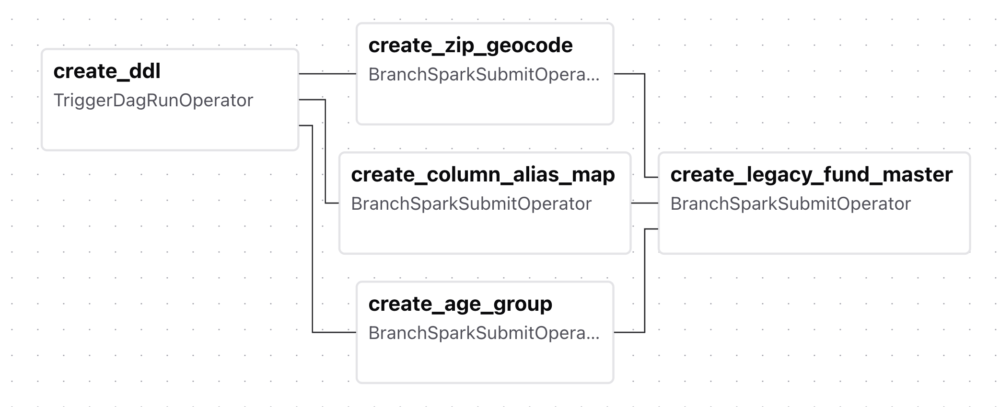
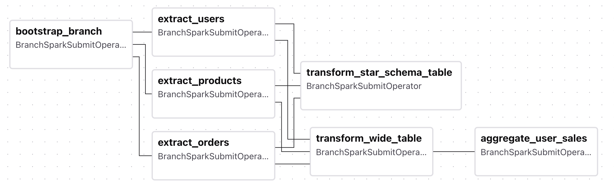
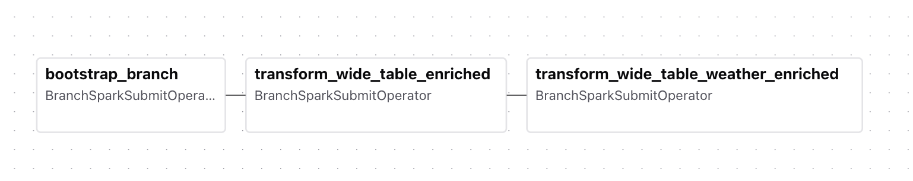
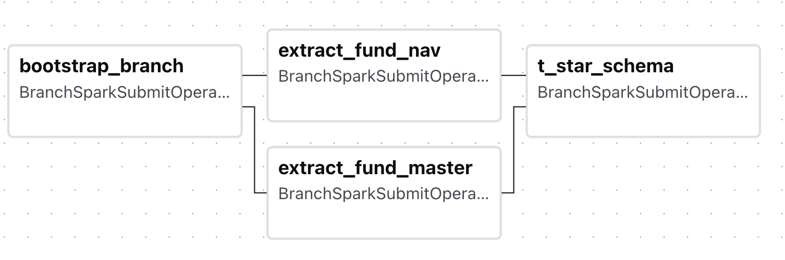
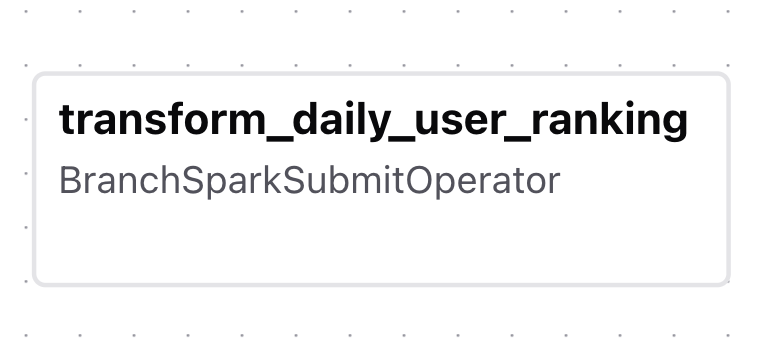

# Airflow

Apache Airflow は、データ処理やバッチ処理などの一連のジョブをワークフローとして定義し、スケジュール実行、依存関係制御、再実行、監視を行うためのワークフローエンジンです。

処理の流れを DAG で表現できるため、どのジョブがどの順番で実行されるのか、どこで失敗したのかを把握しやすく、データ基盤や分析基盤で広く利用されています。

本リポジトリでは、データ取り込み、変換、集計、データ活用といった一連のパイプラインを管理するために Airflow を利用しています。

いくつかJobの構成にはパターンがありますが
マスター DAG + TriggerDagRunOperatorの形式で今回は紹介します。

# トラブルシュート（ソースの変更が反映されない）

変更したソースは、Sparkのクラスターへ配布することで全てのワーカーが参照できるようになるため以下のように環境のバンドルごとにzipファイルを作成して再配置をする必要があります。
(初回は起動時に配置していますが、変更後は再度配置する必要があります)

```

docker exec -it airflow-airflow-worker-1 bash -c "cd /opt/airflow/bundles/prod/scripts && zip -r /opt/airflow/prod_scripts.zip ."
docker exec -it airflow-airflow-worker-1 bash -c "cd /opt/airflow/bundles/dev/scripts && zip -r /opt/airflow/dev_scripts.zip ."

```

# 接続情報

## ホストからのアクセス
| 項目 | アクセス           | ユーザー | パスワード |
|------------------------|------------------------|---------|-----------|
|   Airflow WebUI     |  http://localhost:8094/home       | admin   | admin     |

# 初期設定

## Airflowで構築済みのパイプライン
##　本書を読むためのデータやテーブル名
紙面の都合上すべてのデータを都度載せることはできないので、共通的なデータやソース部分に近いテーブルの一部はここにまとめて記載します。
テーブル名が出てきた際には、こちらのページを参照してデータのイメージを思い出してください。
※パイプラインの画像はAirflowのUIをキャプチャしたものです。

手元で実行する場合以下のパイプラインは依存関係があるので、以下の順番で実行されることを想定しています。
1. init_pipeline
2. basic_pipeline
3. enrich_pipeline
4. data_utilize_pipeline

fund_pipelineやstreaming_pipelineは、init_pipelineが実行されていれば依存はなく必要に応じて実行します。

### init_pipeline



本書を始めるための初期設定を行うパイプラインです。Dockerの起動時に自動で実行されます。
主な仕事は以下になります。

1. Icebergのテーブルの作成(namespace)
2. 参照テーブルの作成
3. 移行元データ(legacy系)テーブルの作成

#### 参照テーブルの作成

**1. local_data_platform.ref.age_group_ref**
年齢コードとラベルのマッピングを提供するテーブルです。

```local_data_platform.ref.age_group_refテーブル

>>> spark.table("local_data_platform.ref.age_group_ref").show()
+--------+---------+                                                            
|age_code|age_label|
+--------+---------+
|      A1|     10代|
|      A2|     20代|
|      A3|     30代|
|      A4|     40代|
|      A5|     50代|
|      A6|     60代|
|      A7|     70代|
|      A8|     80代|
|      A9|     90代|
|     A10|    100超|
+--------+---------+

```

2. **local_data_platform.ref.column_alias_map**
名寄せのための正規表現定義を提供するテーブルです。

```local_data_platform.ref.column_alias_mapテーブル

>>> spark.sql("select * from local_data_platform.ref.column_alias_map").select("canonical_name","priority","updated_at","regex").show(truncate=False)

+------------------+--------+--------------------------+---------------------------------------------+
|canonical_name    |priority|updated_at                |regex                                        |
+------------------+--------+--------------------------+---------------------------------------------+
|fund_nickname     |1       |2025-09-11 13:10:55.411355|^(愛称|ニックネーム|nickname)$                  |
|management_company|1       |2025-09-11 13:10:55.411355|^(運用会社|マネジメント会社|mgmt_?company)$      |
|fund_name         |1       |2025-09-11 13:10:55.411355|^(ファンド名|fund(_)?name)$                    |
|trust_fee_rate    |1       |2025-09-11 13:10:55.411355|^(信託報酬_?率?|management[_ ]?fee|fee_rate)$  |
|hidden_cost       |1       |2025-09-11 13:10:55.411355|^(隠れコスト(率)?|hidden[_ ]?cost)$            |
|valid_flag        |1       |2025-09-11 13:10:55.411355|^(有効レコード|is[_ ]?active|valid[_ ]?flag)$  |
+------------------+--------+--------------------------+---------------------------------------------+

```

3. **local_data_platform.ref.zip_geocode**
郵便番号と緯度・経度のマッピングを提供するテーブルです。

```local_data_platform.ref.zip_geocodeテーブル

>>> spark.table("local_data_platform.ref.zip_geocode").show(truncate=False, n=10)
+--------+---------------------------+--------+---------+                       
|zip_code|address                    |latitude|longitude|
+--------+---------------------------+--------+---------+
|0051739 |神奈川県横浜市泉区4丁目        |35.417  |139.487  |
|0095849 |東京都江東区5丁目             |35.67   |139.82   |
|0010205 |神奈川県横浜市緑区5丁目        |35.517  |139.54   |
|0046196 |神奈川県横浜市神奈川区2丁目     |35.475  |139.633  |
|0078679 |東京都中野区4丁目             |35.707  |139.665  |
|0050646 |大阪府大阪市鶴見区4丁目        |34.711  |135.567  |
|0044866 |大阪府大阪市住之江区2丁目      |34.612  |135.475  |
|0031000 |大阪府大阪市阿倍野区4丁目      |34.648  |135.513  |
|0083442 |大阪府大阪市城東区5丁目        |34.704  |135.561  |
|0020160 |大阪府大阪市旭区1丁目         |34.725  |135.54   |
+--------+---------------------------+--------+---------+

```

※緯度経度は正確な値ではありません。あくまでサンプルデータとして利用することを目的としています。  

#### 移行元データ(legacy系)テーブルの作成

1. **spark_catalog.legacy.legacy_fund_master**

は、移行元・別システムのファンドマスターテーブルです。
本テーブルはIceberg形式ではなくParquet形式で保存されています。

```spark_catalog.legacy.legacy_fund_masterテーブル
>>> spark.table("spark_catalog.legacy.legacy_fund_master").show(n=2,truncate=False)
+-------+-------------+-----------+------------+-------------------+----------------+-----------------------+----------+--------------+-----------+
|fund_id|投資信託_分類  |信託報酬_率  |有効レコード  |ファンド名          |愛称             |運用会社                |隠れコスト  |内部戦略コード. |ingest_date|
+-------+-------------+-----------+------------+-------------------+----------------+-----------------------+----------+--------------+-----------+
|NFD001 |ACTIVE       |1.20       |true        |グローバルファンドA   |成長最強ファンド   |ファンド運用会社A        |3.15      |STRAT-GQA-01  |2025-07-27 |
|NFD002 |INDEX        |0.11       |true        |債券ファンドB        |夜も快眠ファンド   |ファンド運用会社B（株）   |0.22      |STRAT-EQT-12  |2025-07-27 |
+-------+-------------+-----------+------------+-------------------+----------------+-----------------------+----------+--------------+-----------+

```

## basic_pipeline



1. データソースにおける、ordersテーブル、productテーブル、peopleテーブルからのデータを並列で取得
2. 2-1 比較のため、データを結合してワイドテーブル化(シルバー)
3. 2-2 比較のため、スタースキーマによるディメンショナルテーブル化(シルバー)
4. ユーザごとの売上の集計を行う

boostrap_branchは、Icebergのブランチを作成するためのタスクです。

パラメーター:

branch:
Jobのパラメーターでbranch名を指定すると、指定したブランチが作成されそのブランチへデータが書き込まれます。

実行モード:
BRANCH  ->  ブランチを作成し、そのブランチにデータを書き込むモード
ZERO_COPY  ->  データをコピーせずに別のnamespaceへ定義をコピーし、そちらにデータを書き込むモード

extract_mode:
抽出モード（logical_dateを基準に抽出, ALL: 全件抽出）をおこない、データの抽出日(ingest_date)パーティションにデータを保存します。

### extract_*
データソースのデータを取得しテーブル化します。

1. **local_data_platform.brz_ingestion.orders**
ユーザごとの注文情報を保持するテーブルです。

```local_data_platform.brz_ingestion.ordersテーブル

>>> spark.table("local_data_platform.brz_ingestion.orders").show(n=2,truncate=False)
+--------+-------+----------+------------+-------+---------+--------+-----------+-------------------+---------+-----------+--------------------+
|order_id|user_id|product_id|subtotal_usd|tax_usd|total_usd|quantity|status_flag|created_at         |parent_id|ingest_date|user_id_hash        |
+--------+-------+----------+------------+-------+---------+--------+-----------+-------------------+---------+-----------+--------------------+
|5       |52     |88        |83          |8      |91       |1       |1          |2024-08-23 07:03:21|NULL     |2025-09-05 |-8668973528657799024|
|7       |2      |72        |45          |5      |50       |4       |1          |2024-09-08 07:03:21|NULL     |2025-09-05 |8420071140774656230 |
+--------+-------+----------+------------+-------+---------+--------+-----------+-------------------+---------+-----------+--------------------+

```

2. **local_data_platform.brz_ingestion.users**
ユーザ情報を保持するテーブルです。

```local_data_platform.brz_ingestion.usersテーブル
>>> spark.table("local_data_platform.brz_ingestion.users").show(n=2,truncate=False)
+-------+-----------------------------------+-----------------+--------+---------+-------------------+----------+--------+-------------------+-------------------+----------+----------+-----------+-------------------+
|user_id|address                            |email            |password|user_name|acquisition_channel|birth_date|zip_code|created_at         |updated_at         |is_deleted|deleted_at|ingest_date|user_id_hash       |
+-------+-----------------------------------+-----------------+--------+---------+-------------------+----------+--------+-------------------+-------------------+----------+----------+-----------+-------------------+
|1      |神奈川県横浜市泉区4丁目15番4号         |user1@example.com|pass1   |User 1   |Facebook           |1990-07-17|0051739 |2024-09-23 07:03:21|2024-09-23 07:03:21|false     |NULL      |2025-09-05 |-928762887014768240|
|4      |神奈川県横浜市神奈川区2丁目11番47号     |user4@example.com|pass4   |User 4   |Instagram          |1978-04-19|0046196 |2024-10-29 07:03:21|2024-10-29 07:03:21|false     |NULL      |2025-09-05 |3413059497672580978|
+-------+-----------------------------------+-----------------+--------+---------+-------------------+----------+--------+-------------------+-------------------+----------+----------+-----------+-------------------+
```

3. **local_data_platform.brz_ingestion.products**
商品情報を保持するテーブルです。

```local_data_platform.brz_ingestion.productsテーブル

>>> spark.table("local_data_platform.brz_ingestion.products").show(n=2,truncate=False)
+----------+-------------+----------------------+--------+-----------+---------+------+-------------------+-------------------+----------+----------+-----------+
|product_id|ean_code     |product_title         |category|vendor_name|price_usd|rating|created_at         |updated_at         |is_deleted|deleted_at|ingest_date|
+----------+-------------+----------------------+--------+-----------+---------+------+-------------------+-------------------+----------+----------+-----------+
|1         |2770735575101|ウィメンズジャケット S   |C02     |三菱電機     |12534    |3.7000|2025-01-17 10:11:09|2025-02-09 10:11:09|false     |NULL      |2025-09-05 |
|2         |1724396229455|メンズTシャツ Lサイズ    |C02     |花王        |19765    |1.8000|2024-09-18 10:11:09|2024-10-10 10:11:09|false     |NULL      |2025-09-05 |
+----------+-------------+----------------------+--------+-----------+---------+------+-------------------+-------------------+----------+----------+-----------+
```

### transform_wide_table
orders、people、productsテーブルを結合してワイドテーブル化したものです。

1. **local_data_platform.slv_analytics.user_orders_wide**

### transform_star_schema_table

orders、people、productsテーブルをスタースキーマによるディメンショナルテーブル化したものです。

- local_data_platform.slv_analytics.dim_customer
- local_data_platform.slv_analytics.dim_product
- local_data_platform.slv_analytics.dim_date
- local_data_platform.slv_analytics.fact_orders

### aggregate_user_sales

1. **local_data_platform.gld_mart.user_sales**

ユーザごとの売上を集計したものです。

```
>>> spark.sql("select * from local_data_platform.gld_mart.user_sales").show(n=2)
+-------+---------+-----------+-----------+
|user_id|user_name|order_count|total_sales|
+-------+---------+-----------+-----------+
|     50|  User 50|          1|      51.00|
|     71|  User 71|          1|      15.00|
+-------+---------+-----------+-----------+

```

## enrich_pipeline

データをエンリッチングするためのパイプラインです。



1. local_data_platform.slv_analytics.user_orders_wideをもとに、zip_geocodeテーブルを結合して、ユーザの住所情報に緯度・経度を付与
2. 1のデータをもとに、緯度と経度を用いて、天気情報を取得し付与する(local_data_platform.slv_analytics.user_orders_wide_weather_enrichedテーブル)

## data_utilize_pipeline

エンリッチングしたデータをデータ活用するためのパイプラインです。


1.  local_data_platform.slv_analytics.user_orders_wide_weather_enrichedテーブルをもとに、施策(クーポン配布)のためのユーザーを抽出
2.  抽出したユーザーをMongoDBのuser_data.user_ctx_{env}へ保存する

## fund_pipeline
ファンドのデータ分析に利用するパイプラインです。



### ファンドマスターテーブルとファンドNAVテーブルを取得

V1とV2があり、V1がオリジナルのマスター。V2はマスターの一部を変更したもの（FND002の信託報酬の引き下げと、 FND003の追加）です。
時間が経過しデータが変更されたというイメージとしてV2を用意しています(Jobのパラメーターにも登場します)。

**1. local_data_platform.brz_ingestion.fund_master**
ファンドのマスターデータを保持するテーブルです。

```local_data_platform.brz_ingestion.fund_masterテーブル
>>> spark.table("local_data_platform.brz_ingestion.fund_master").show(n=2,truncate=False)
+-------+-------------+--------------+---------+-------------------+----------------+------------------+------------+------------------+-----------+
|fund_id|fund_category|trust_fee_rate|is_active|fund_name          |nickname        |management_company|manager_name|manager_email     |ingest_date|
+-------+-------------+--------------+---------+-------------------+----------------+------------------+------------+------------------+-----------+
|FND001 |ACTIVE       |1.20          |true     |グローバルファンドA   |成長最強ファンド   |ファンド運用会社A    |田中太郎     |tanaka@example.com|2025-09-05 |
|FND002 |INDEX        |0.25          |true     |債券ファンドB        |夜も快眠ファンド   |ファンド運用会社B    |鈴木一郎     |suzuki@example.com|2025-09-05 |
+-------+-------------+--------------+---------+-------------------+----------------+------------------+------------+------------------+-----------+
```

**2. local_data_platform.brz_ingestion.fund_nav**
ファンドの日々の基準価格を保持するテーブルです。

```local_data_platform.brz_ingestion.fund_navテーブル

>>> spark.table("local_data_platform.brz_ingestion.fund_nav").show(n=2,truncate=False)
+----------+-------+---------+
|base_date |fund_id|nav_price|
+----------+-------+---------+
|2025-05-01|FND001 |11032.82 |
|2025-05-02|FND001 |11030.71 |
+----------+-------+---------+

```

### スタースキーマによるディメンショナルテーブル化

テーブルデータをスタースキーマにてモデリングしたものです。

- local_data_platform.slv_entities.dim_customer - 顧客ディメンション
- local_data_platform.slv_entities.dim_product - 商品ディメンション
- local_data_platform.slv_entities.dim_date - 日付ディメンション
- local_data_platform.slv_entities.fact_orders - 注文ファクトテーブル

## streaming_pipeline

ストリーミングのデータを用いて課金額ごとにランキングを作成する関するパイプラインです。
ラムダアーキテクチャの確報値の算出としてストリーミングにて保存したデータを取得後（ニア）リアルタイムでランキング情報をMongoDbやIcebergテーブルに保存します。



**1. local_data_platform.gld_mart.daily_user_ranking**
orders_simulator.pyにて生成されたデータをマイクロバッチで取得し保存したrawデータが保管されているテーブル(local_data_platform.brz_ingestion.orders_microbatch)を
利用してランキングを算出し保存するテーブルです。
