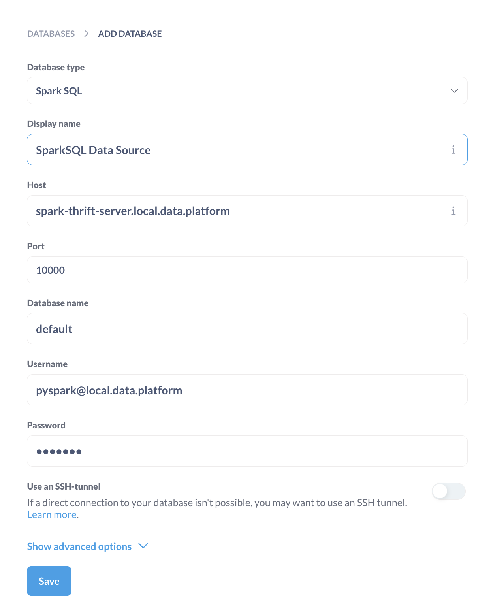
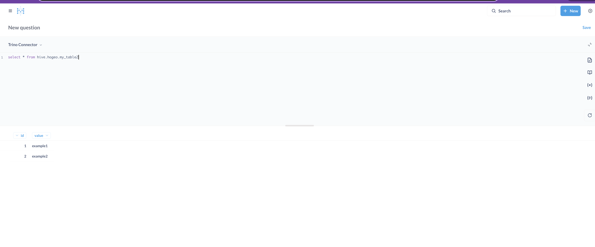

<p align="center"><b>以下の書籍に関するリポジトリです。</b></p>

<p align="center">
    <a href="https://www.amazon.co.jp/dp/4297145634/ref=sspa_dk_detail_0?psc=1&pd_rd_i=4297145634&pd_rd_w=BXEhW&content-id=amzn1.sym.f293be60-50b7-49bc-95e8-931faf86ed1e&pf_rd_p=f293be60-50b7-49bc-95e8-931faf86ed1e&pf_rd_r=VZ7P7XN3YX1NAMJAPZEB&pd_rd_wg=CuOVv&pd_rd_r=31953068-34be-40e1-978d-b417f6b20227&s=books&sp_csd=d2lkZ2V0TmFtZT1zcF9kZXRhaWw">
        
    </a>
    <a href>
        
    </a>
</p>


# Metabase
Metabase は、オープンソースのビジネスインテリジェンス（BI）ツールで、データの可視化や簡易分析を行うためのプラットフォームです。
エンジニアだけでなく、データ分析の専門家ではないユーザーにも使いやすいインターフェースを提供しており、データベースと簡単に接続してインサイトを得ることができます。

https://www.metabase.com/

# 接続情報

## ホストからのアクセス
| 項目 | アクセス |  ユーザー |  パスワード |
|--------|---------|------------------|-------------------|
| Metabase Web UI | http://localhost:13000 | admin@metabase.local | Metapass123 |

Ldapとも連携しているのでLdapユーザでもログイン可能です([OpenLdap](../openldap/README.md))。

#　初期設定

## コネクターの作成

Metabaseから、各クエリエンジンへ接続するための設定をコネクターと呼んでいます。
Metabaseではコネクターを設定後SQLを発行することが可能になります。

adminでログイン後、画面右上の歯車マーク->「Admin Settings」-> 「Databases」タブ ->  「AddDatabase」
※起動時のブートストラップでも作成のスクリプトを入れていますが接続先のサーバーが起動していないと接続を作成できません。

作成されていない場合は、以下の設定をもとにGUIからコネクターを作成してください。

## Spark SQL(Spark Thrift経由)

[spark](../spark/README.md)が起動している必要があります。



設定コピペ用

```
    "engine": "sparksql",
    "name": "SparkSQL Data Source",
    "details": {
        "host": "spark-thrift-server.local.data.platform",
        "port": 10000,
        "db": "gld_mart",
        "user": "pyspark@local.data.platform",
        "password": "pyspark",
        "additional-options": ""
    }
```

## Trino

同様に以下の設定値でTrinoとの接続を設定します。
[Trinoクラスター](../trino/README.md)と[リバースプロキシ](../reverse-proxy/README.md)が起動している必要があります。

また、TrinoにはRangerによる認可設定が入っているため認証だけでなく認証後の設定が必要になります(RangerのReadme参照)。

```

    "engine": "starburst",
    "name": "Trino Connector",
    "details": {
        "host": "reverse-proxy.local.data.platform",
        "port": 443,
        "catalog": "iceberg_prod",
        "schema": "gld_mart",
        "user": "pyspark@local.data.platform",
        "password": "pyspark",
        "use-ssl": true,
        "additional-options": ""
    }

```

## SQLの発行

「+ New」-> 「SQL query」->「Trino Connector」or 「Spark SQL Connector」を選択

SQLを記述してCTL(CMD) + ENTERでSQLを実行可能です。



# コミュニティコネクターの利用

Trinoのコネクターは[コミュニティコネクター](https://github.com/starburstdata/metabase-driver)を利用しています。

公式のTrinoのサポートのバージョンは431ですが、(今回の解説においてはMetabaseの利用は簡易的で影響がないため)467以降のバージョンで利用しています。

```

{
    "trino": "431",
    "clojure": "1.11.1.1262",
    "metabase": "v1.50.9"
}

```