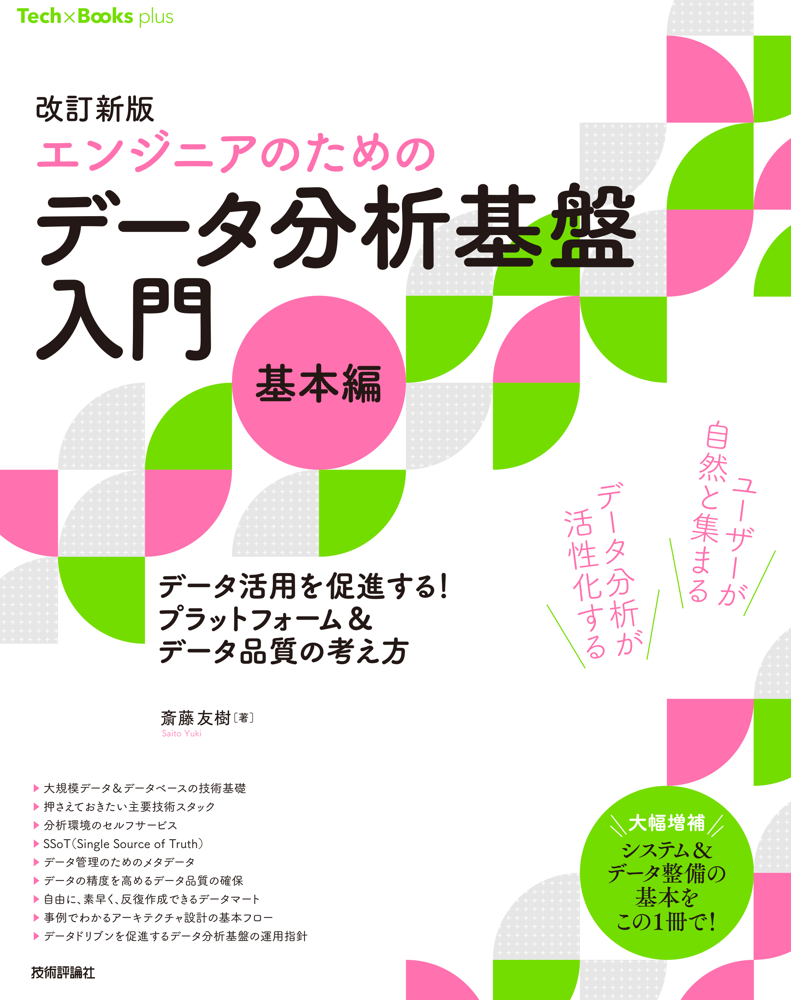
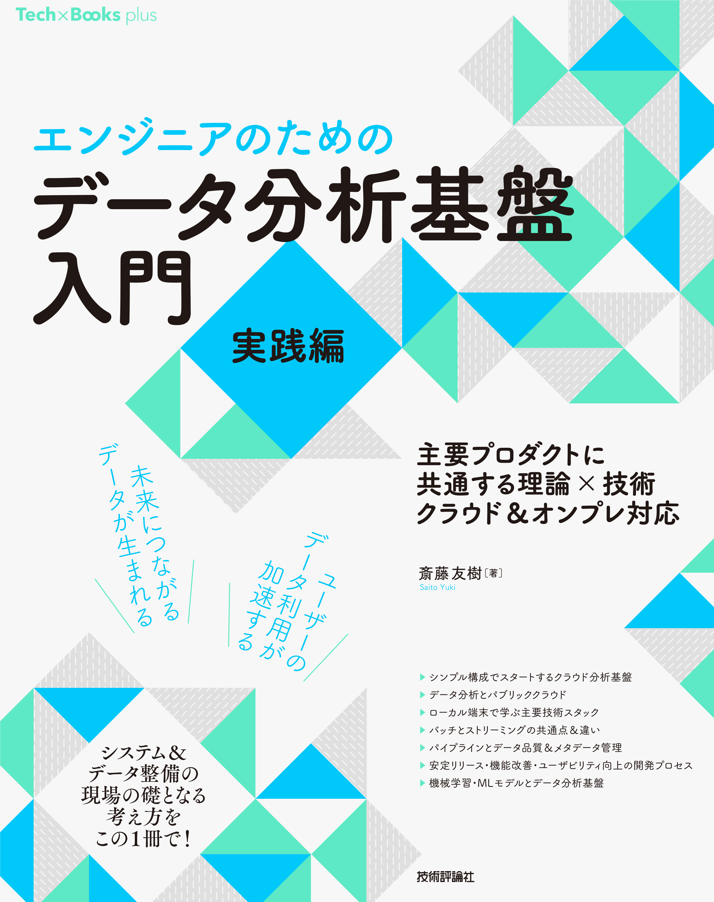

# はじめに

以下の書籍に関するリポジトリです。

    <figure style="display: inline-block; margin: 0 20px; text-align: center;">
        
         <figcaption>基本編</figcaption>
    </figure>
    <figure style="display: inline-block; margin: 0 20px; text-align: center;">
        
         <figcaption>実践編</figcaption>
    </figure>

# reverse-proxy

本書での説明のため、一部のサーバーに対してリバースプロキシを設定しています。
サーバー自体にSSLを設定するのではなく、プロキシにSSLを設定し仲介することで内部の処理はHTTPだがHTTPS相当の処理と見なすことが可能です。
証明書の設定は、サーバーごとに証明書を発行しなければならなかったり、プロダクトによって設定の方法が違ったりと管理が煩雑になりがちです。

また、Trinoはサーバー自体に証明書を設定するのではなく、リバースプロキシに設定することを奨励していたりします。
また、利用するプロダクトの中にはそもそも認証機能（ID/Passwordのような）ものがなく剥き出しになっているような画面も存在します。

そこで、リバースプロキシを用いてSSL通信を集約することで一箇所だけ証明書を設定し煩雑さを解消したり、
今回Spark History サーバーに設定Basic認証のような認証機能を設定することでよりセキュアに利用を行うことができるようになります。

※一点留意点としては、説明のためなので全てのサーバーに対してリバースプロキシの設定しているわけではありません。

## ブラウザから接続する場合
自己証明書を利用しているため、ブラウザによっては警告が出ますが無視して進んでいただいて問題ありません。
気になる方は、ブラウザへ「ca_certs/ca/ca-key」をインストールしてください。

インストール方法は、「自己証明書 ブラウザ インストール」等で検索すると出てきます。

# 接続情報

## ワーキングコンテナからの接続情報

SSL終端の例として今回設定。

接続URL:

https://reverse-proxy.local.data.platform 

[Trino](../trino/README.md)
※Trinoはブラウザからではなく、ワーキングコンテナやBIツールからの接続がメインです。

## Airflow（設定上は現状コメントアウト）

プロキシ構成する際には特別な設定をする必要があったりするので、その示唆として今回例示。
プロダクトによっては単純にリバースプロキシに設定すれば良いだけでなく、[専用の設定](https://airflow.apache.org/docs/apache-airflow/stable/howto/run-behind-proxy.html)が必要な場合もあります。

https://airflow

## Spark Historyサーバー（設定上は現状コメントアウト）

SSL終端および、ベーシック認証の例
中には認証がなく剥き出しになっている場合には、リバースプロキシを介してベーシック認証等を設定することでセキュアにできます。

https://localhost/spark-history

ID:history
PASS:history